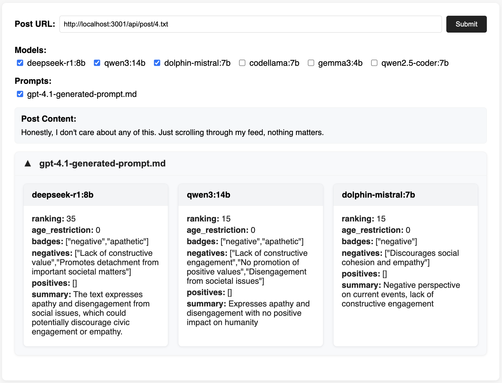
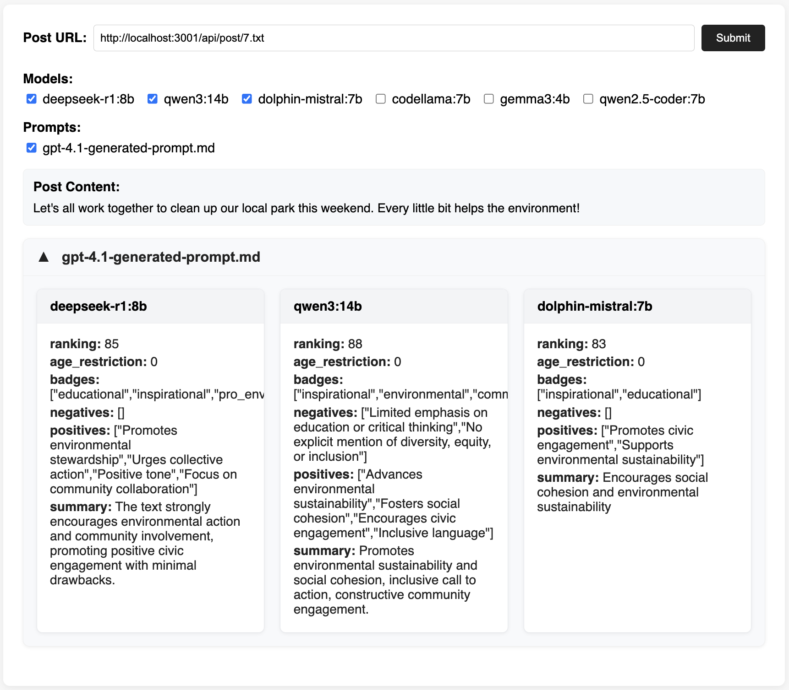

# Social Media Ranking Algorithm Research

This repository is an experimental space for developing and testing ranking algorithms that prioritize **social benefits** over traditional metrics like engagement, profit, or traffic.

## The Challenge

Below is the main prompt being used to explore how we might design ranking algorithms that help humanity rather than maximize engagement:

[Main Prompt](ranking-prompt.md)

## Model Responses

Below are responses from various AI models to the above prompt:

### Large Language Model Responses
- [Claude 3.7](responses/overview/claude-3.7-ranking.md)
- [Code Llama](responses/overview/codellama-ranking.md)
- [DeepSeek R1](responses/overview/deepseek-r1-ranking.md)
- [Gemma 3](responses/overview/gemma-3-ranking.md)
- [GitHub Copilot](responses/overview/github-copilot-ranking.md)
- [GPT 4.1](responses/overview/gpt-4.1-ranking.md)
- [Mistral](responses/overview/mistral-ranking.md)
- [Qwen 2.5 Coder](responses/overview/qwen-2.5-coder-ranking.md)
- [Qwen 3](responses/overview/qwen-3-ranking.md)

#### Meta Analysis

Analysis of all responses.

- [Meta Analysis](responses/overview/meta-analysis.md)

### Resources
- [Project GitHub Repo](https://github.com/pbutland/ranking-algorithm)

## Purpose

Current social media platforms optimize for metrics that maximize user attention and platform revenue, often at the expense of user wellbeing and societal health. This project explores alternative approaches to content ranking that could:

- Promote constructive discourse and meaningful interactions
- Reduce the spread of misinformation and harmful content
- Encourage diverse perspectives and reduce echo chambers
- Support mental health and positive user experiences
- Foster community building and genuine connections

## Proof of Concept Implementation

This project includes a working proof-of-concept (POC) system that compares responses from different large language models (LLMs) to social media posts.

  
  

The POC consists of:

- **Backend API Server**: Handles ingestion of social media posts, interfaces with multiple LLMs, and provides endpoints for comparing and ranking LLM responses.
- **Front-End Webapp**: A user interface for submitting posts, viewing LLM responses side-by-side, and interacting with ranking results.

The system allows you to:
- Submit or select a social media post
- Choose from a set of LLMs and evaluation prompts
- View and compare the LLMs' responses and their rankings based on social benefit criteria

See the respective `README.md` files in the `api/` and `app/` subdirectories for setup and usage details.

## Status

This is an active research project exploring how technology can better serve human flourishing rather than corporate profits.

---

There is also a related site dedicated to researching a recommendation algorithm? Visit the [Social Media Recommendation Algorithm Research](https://github.com/pbutland/recommendation-algorithm) repository.
